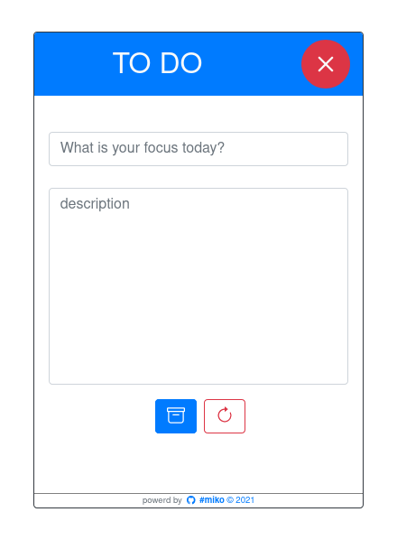

# todo-widget

the minimal todo app for using as widget

## Menu

- [Project Setup](#project-setup)
- [Screenshots](#screenshots)

## Project setup

- installing dependencies `$ npm install`
- Compiles and hot-reloads for development `$ npm run serve`
- Compiles and minifies for production `$ npm run build`
- Lints and fixes files `$ npm run lint`

> Customize configuration
> See [Configuration Reference](https://cli.vuejs.org/config/).

[:arrow_up: back to top](#menu)

## Screenshots

> this todo use `localStorage` for saving data
>
> may change to `indexedDB`

[:arrow_up: back to top](#menu)

## License

Under [MIT](./LICENSE) License
